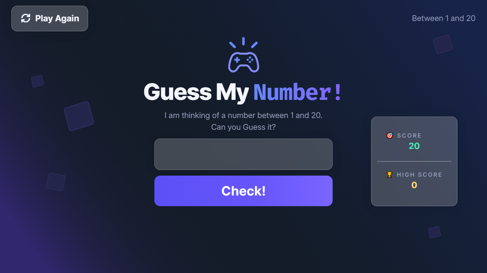

# Guess My Number - Game

You might have encountered many Guess My Number games, but this time I created something different. I used GSAP to add some animations. There is small secret in the game which you can discover by playing it.

Currently, it has only one basic level where you have to guess a number between 1 and 20. I have a plan to add 20 levels gradually getting harder at the end.

## Technologies Used

I kept in mind that it should be easier for beginners to recreate this game to add it in their portfolios. So, I used:

- HTML
- CSS
- Vanilla JavaScript
- GSAP for Animations
- Google Fonts

I kept the game simple and easy to play. Also there some basic easy to understand animations.

I used **Figma** to design the app and **Adobe Illustrator** to create the SVG Background image. I know we can create that SVG Background in Figma, but sometimes I like to use Illustrator. It was fun to recreate this from the previous basic version that I built in a Udemy course.

## A Look



## How to Set Up Locally

Before setting up the project, make sure you have **Node.js** installed on your computer.

If you don't have Node.js installed, download and install it from [Node.js](https://nodejs.org/en/download?utm_source=chatgpt.com).

### 1. Download the Repository

You can download the project in either of two ways.

**Option 1 — Download ZIP**

Click the green **Code** button on the GitHub repository, then select **Download ZIP**. Extract the downloaded ZIP file and open the project folder in your terminal.

**Option 2 — Clone with Git**

If Git is installed on your computer, open your terminal and run:

```bash
git clone https://github.com/Mini-Elliot/guess-my-num.git
```

### 2. Install Dependencies

Navigate to the project directory and install the required dependencies:

```bash
npm install
```

### 3. Start the Development Server

Once the dependencies have been installed, start the development server:

```bash
npm run dev
```

The terminal will provide a local URL where you can open the project in your browser.
